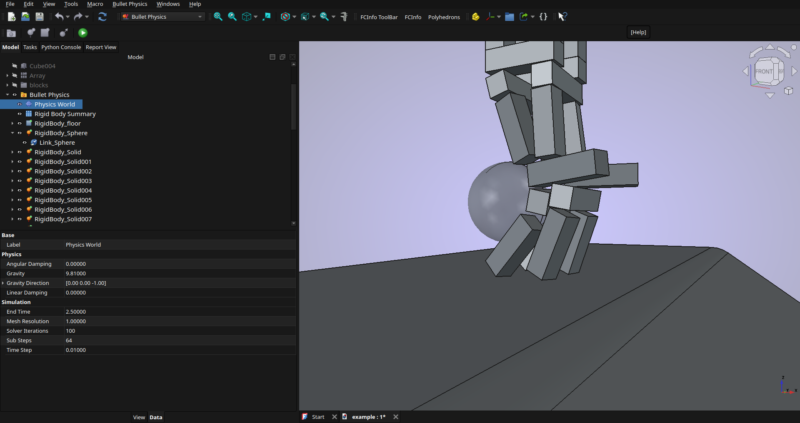

# FreeCAD Bullet Physics Workbench

A rigid-body physics simulation workbench for FreeCAD powered by [pybullet](https://github.com/bulletphysics/bullet3). Simulate objects falling, colliding, and settling, then play back the result on an interactive timeline.

---

## Screenshots

Video tutorial in screenshot/tutorial.mp4




---

## Features

- **Active & Passive rigid bodies** — active bodies are driven by physics; passive bodies act as static colliders (floors, walls, ramps)
- **Velocity Launcher** — Give bodies a velocity to throw at other active bodies
- **Original geometry is never modified** — the workbench drives `App::Link` clones, leaving your original solids untouched and fully editable at all times
- **Automatic collision shape detection** — spheres, cylinders, and boxes get exact analytic collision shapes; any other solid is tessellated into a convex-hull or concave mesh automatically
- **Animation timeline** — scrubber, transport controls (first / step back / play-pause / step forward / last), adjustable playback speed (0.1× – 8×), and loop toggle
- **Simulation cache** — results are saved to disk alongside your `.FCStd` file so the timeline is available immediately on reopening the panel without re-running the simulation
- **Rigid Body Summary table** — editable overview of all bodies (type, density, friction, mesh type, mesh resolution) with bulk-apply inputs for changing multiple bodies at once
- **Bake frame as new origin** — commit any timeline frame back to the original objects as the new rest position; fully undoable with Ctrl+Z
- **Physics World settings** — gravity magnitude and direction, simulation end time, frame time step, sub-steps (accuracy), solver iterations, and global mesh resolution, all stored in the document
- **Recursive downgrade** — Break down array of solids into individual components, useful when setting up a simulation with many solids as rigid body using array and need to separate them.
---

## Requirements

| Requirement | Version |
|---|---|
| FreeCAD | 1.0 or later |
| pybullet | 3.x |

---

## Installation

### 1 — Install pybullet

pybullet must be available to the Python interpreter bundled with FreeCAD.

```bash
python3 -m pip install pybullet
```

On some Linux distributions where the system enforces package isolation you may need:

```bash
python3 -m pip install pybullet --break-system-packages
```

### 2 — Install the workbench

**Option A — FreeCAD Addon Manager (recommended once listed)**

Open FreeCAD → Tools → Addon Manager → search for **Bullet Physics** → Install.

**Option B — Manual**

Clone this repository into your FreeCAD `Mod` folder:

```bash
# Linux / macOS
cd ~/.local/share/FreeCAD/Mod        # FreeCAD 1.x path
# or ~/.FreeCAD/Mod for older versions
git clone https://github.com/kevinsmia1939/FreeCAD-BulletPhysics

# Windows
cd %APPDATA%\FreeCAD\Mod
git clone https://github.com/kevinsmia1939/FreeCAD-BulletPhysics
```

Restart FreeCAD and select **Bullet Physics** from the workbench dropdown.

---

## Quick Start

1. Open or create a FreeCAD document containing at least one solid.
2. Switch to the **Bullet Physics** workbench.
3. Click **Create Physics Container** — this adds a *Bullet Physics* folder to the model tree containing a *Physics World* settings object and a *Rigid Body Summary* table.
4. Select a solid in the 3D view, then click **Add Active Body** (moves with physics) or **Add Passive Body** (static collider).
5. Repeat step 4 for each solid you want to simulate.
6. Adjust physics properties in the **Physics World** object (gravity, end time, time step, etc.) and per-body properties (density, friction, restitution) via the model tree or the Rigid Body Summary table.
7. Click **Run Simulation** in the toolbar to open the simulation panel.
8. Click **Simulate** — a progress bar tracks the run. When it finishes the timeline slider is enabled.
9. Drag the slider or press **Play** to watch the animation.

## License

GPL-3.0-or-later — see [LICENSE](LICENSE).
